# hse21_hw3

## Ссылка на google collab Python https://colab.research.google.com/drive/1CxDCtO0QGeEMWnoSgayS7I3v8_e8T7Z2?usp=sharing
## Ссылка на google collab R https://colab.research.google.com/drive/11FZWEidC_puWsG_fZLiCe7LUzOYvOVCY?usp=sharing

## Часть 1
1. Скриншоты и статистика MultiQC
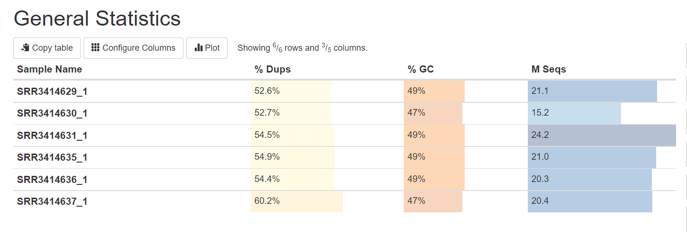
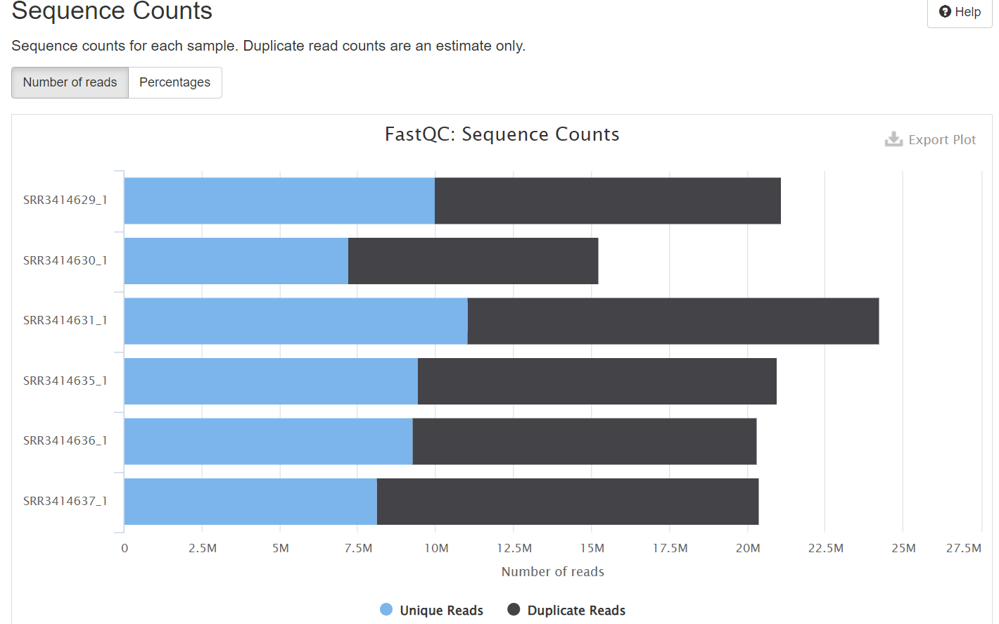
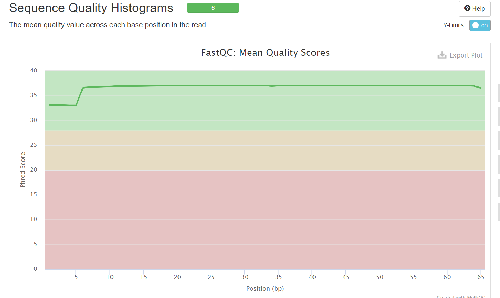
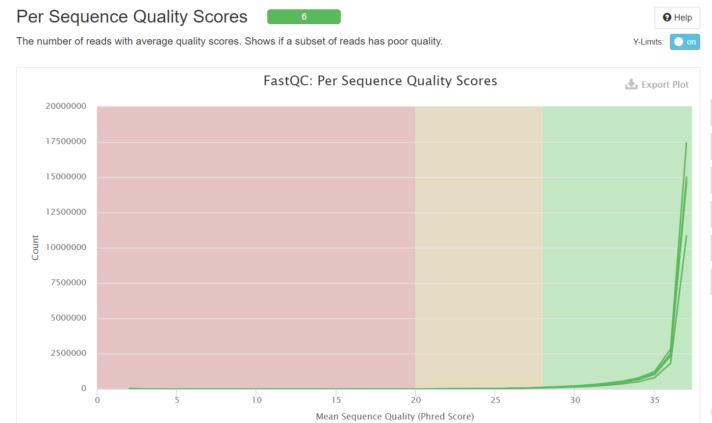
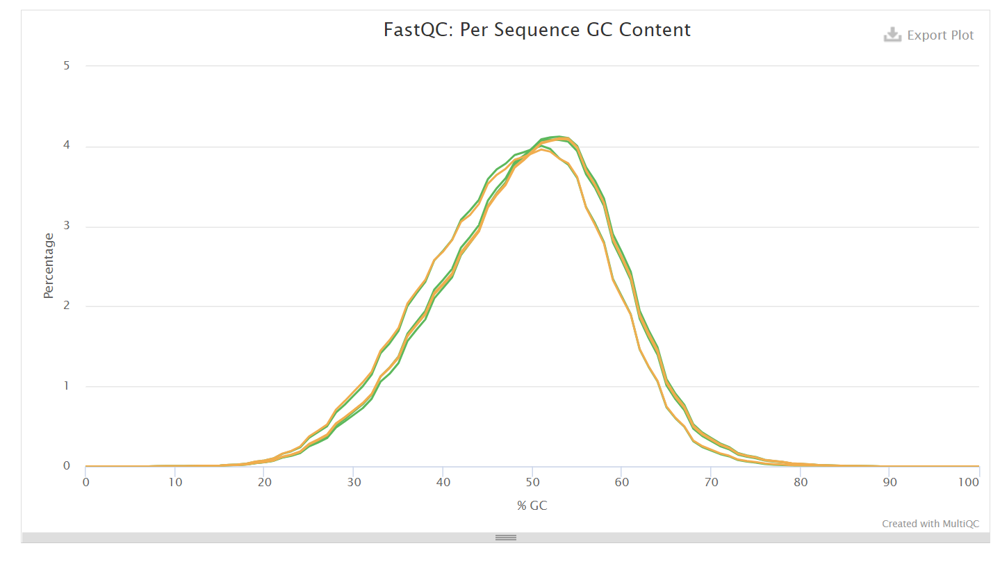
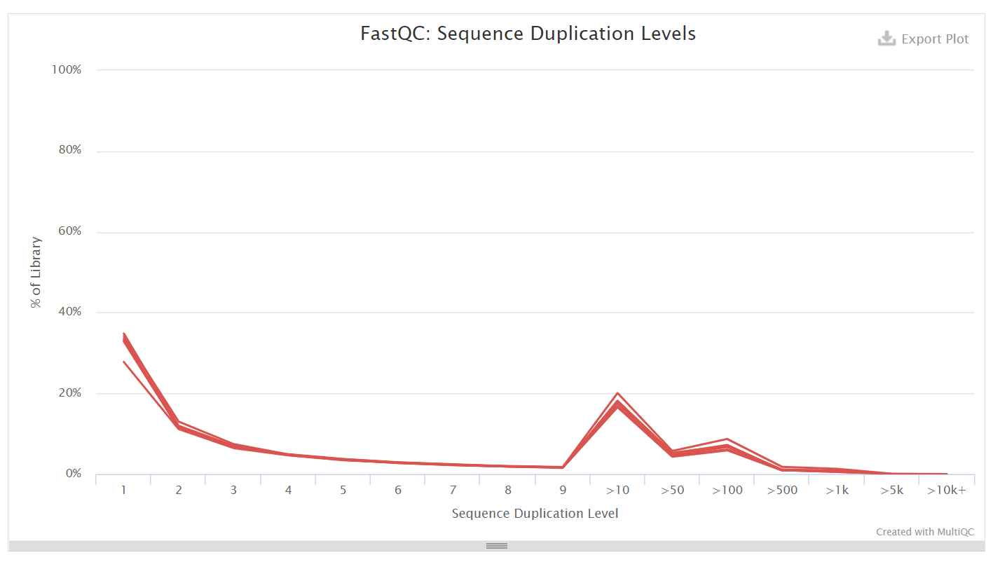

2. Общее число чтений, соответствующих хотя бы одному гену
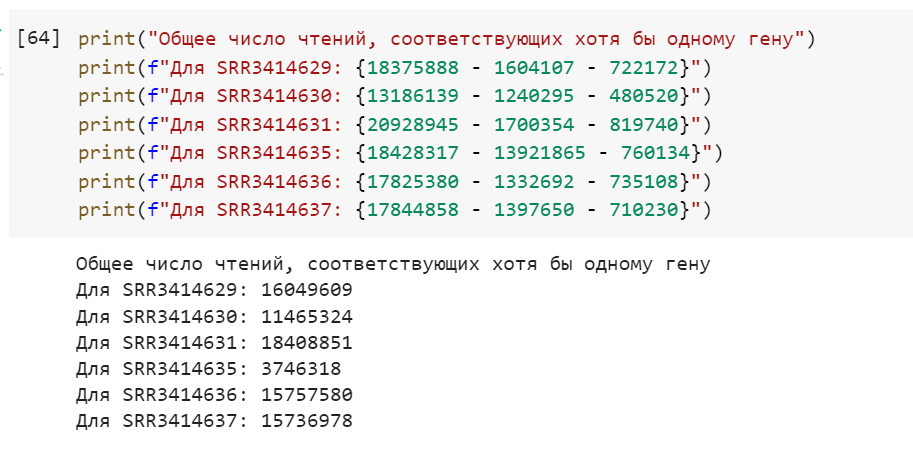

## Часть 2

1. MA-plot
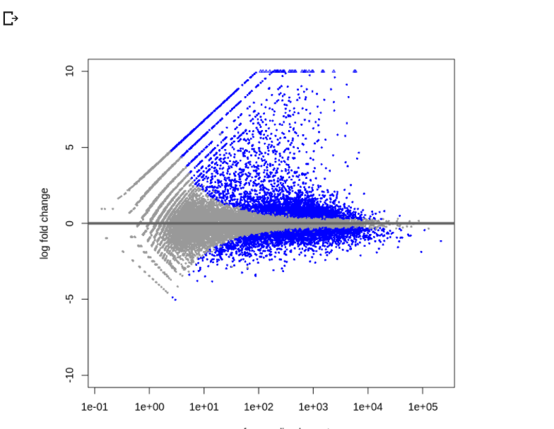

2. Тепловая карта
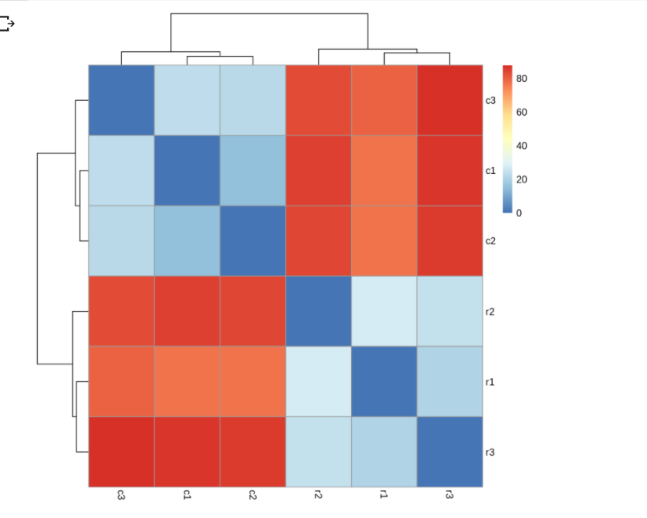
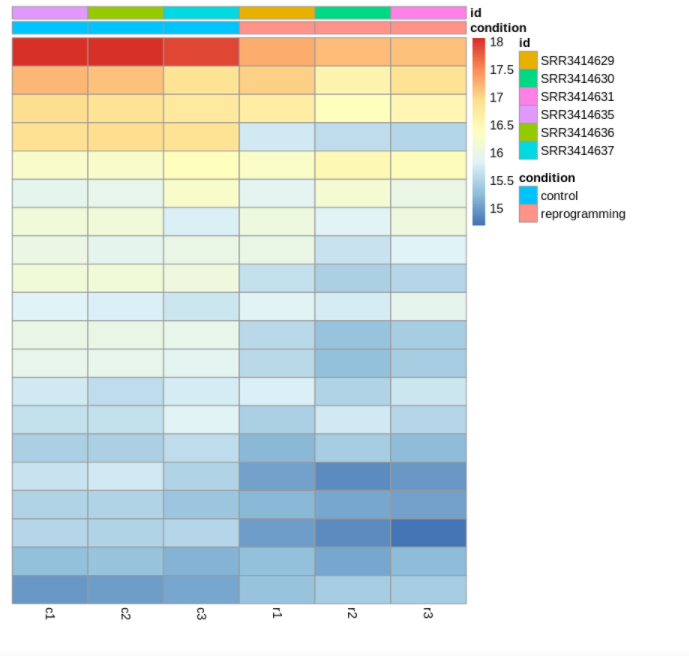

3. Normalized counts в 3х генах, которые наиболее значимо поменяли свою экспрессию
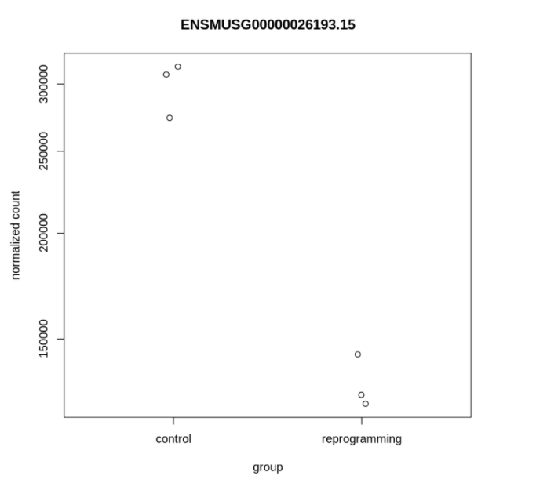
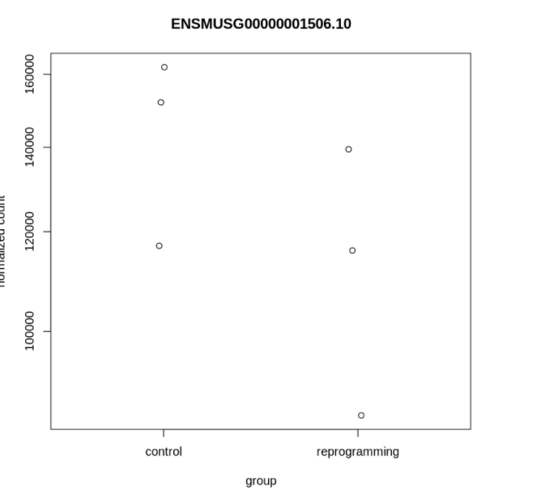
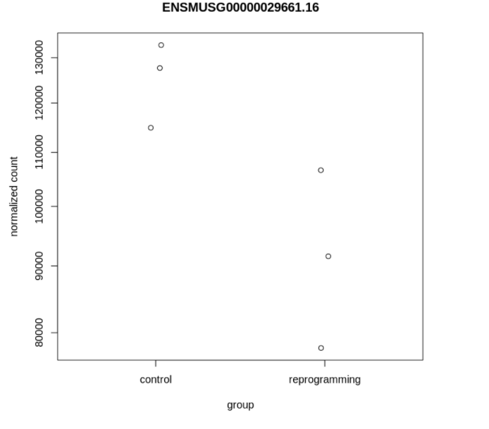
